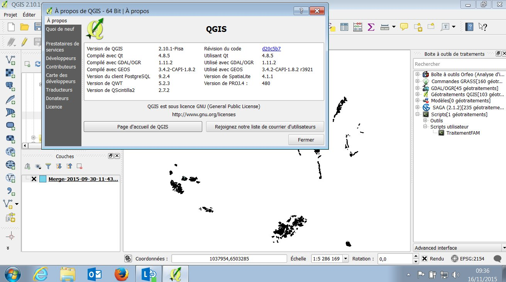

# Pré-requis

Le traitement a été developpé pour QGIS 2.10 "Pisa". Il est compatible QGIS 2.12  "Lyon".

[QGIS 2.10.1 "Pisa" x86_64](http://qgis.org/downloads/QGIS-OSGeo4W-2.12.0-1-Setup-x86_64.exe)

Le traitement est un développement en Python 2.7 utilisant les librairies de traitement cartographique de QGIS.

# Installation du Géotraitement TraitementFAM

Ouvrir QGis Desktop

Si le panneau "Boite à outils de traitements" n'est pas ouvert, sélectionner "Boite à outils" dans le menu "Traitement" pour l'ouvrir.

Dans l'aborescence de la boite à outils, sélectionner "Scripts > Outils > Ajouter un script depuis le fichier". Dans la fenêtre de sélection du fichier, choisisser le traitemet "TraitementFAM.py".

# Lancement du Géotraitement TraitementFAM

Ouvrir QGis Desktop

Si le panneau "Boite à outils de traitements" n'est pas ouvert, sélectionner "Boite à outils" dans le menu "Traitement" pour l'ouvrir.

Dans l'aborescence de la boite à outils, double cliquer sur "Scripts > Scripts utilisateur > TraitementFAM".

Dans la fenêtre du traitement, cliquer sur le bouton "Run" pour lancer le traitement.

## Arborescence des fichiers MapInfo

Le traitement parcours récursivement tous les répertoires commençant par un code postal pour traiter les fichiers MapInfo qui y sont contenus.

Les fichiers MapInfo doivent avoir les attributs suivants :
- INSEE
- COMMUNE
- NOM_AOC
- Géometrie

## Fichier CSV de la liste blanche INAO

Le traitement nécessite une liste blanche INAO au format CSV (séparateur ";" et encodage Windows 1252).

La structure doit être la suivante :
- entête du CSV : IDApp;Libellé Appellation ;Segment
- attributs :
  - IDApp
  - Libellé Appellation
  - Segment

## Résultats du traitement

Les fichiers de resultats se situe à la racine de l'aborescence des fichiers MapInfo séléctionnée.

Les fichiers résultats sont :
- Merge-AAAA-MM-JJ-HH-MM-SS.shp
- InfoLog-AAAA-MM-JJ-HH-MM-SS.csv

Les fichiers sont suffixés par la date (AAAA-MM-JJ-HH-MM-SS) de lancement du traitement.

### Le fichier parcelleaire "Merge-AAAA-MM-JJ-HH-MM-SS.shp"

Ce fichier au format shapefile contient l'ensemble des parcelles traitées avec succès.

### Le fichier de log "InfoLog-AAAA-MM-JJ-HH-MM-SS.csv"

Ce fichier au format CSV contient les informations de débogage.

Les types d'informations sont:
- I1 : Merge des parcelles
- I2 : Traitement effectué

Les types d'erreurs sont:
- E1 : L'appellation de la parcelle traitée ne fait pas partie de la liste blanche -> la parcelle est rejetée
- E2 : L'appellation de la parcelle traitée n'est pas renseignée -> la parcelle est rejetée
- E3 : La géometrie de la parcelle traitée absente -> la parcelle est rejetée
- C1 : Le fichier MapInfo ne peut être chargé pour une raison obscure -> le fichier et ses parcelles sont rejetés
- C2 : Le fichier MapInfo ne peut être traité pour une raison obscure -> le fichier et ses parcelles sont rejetés
- C3 : Ajout des parcelles traitées dans le merge impossible -> toutes les parcelles sont rejetées
- C4 : Absence de champs obligatoires ("INSEE","COMMUNE","NOM_AOC") dans le fichier MapInfo -> le fichier et ses parcelles sont rejetés
- C5 : Les données du fichier MapInfo ne sont pas modifiablepour une raison obscure -> le fichier et ses parcelles sont rejetés

# Fonctionnement de l'algorithme

## Etapes du traitement :

1 - Nettoyage du projet courant.

2 - Interaction utilisateur pour la récupération des paramètres d'entrée.

3 - Initialisation des variables du traitement.

4 - Recuperation de la liste blanche des appellations.

5 - Traitement des couches.

Le traitement parcours récursivement les fichier tab (méthode traitTabs) pour les traiter un à un (méthode traitOneTab).

6 - Dédoublonnage des parcelles validées avec ID_UNI.

7 - Merge dans un shape.

8 - Fin du traitement.

## Méthodes du traitements :

- def getApp(self, csvFile)

  Création du dictionnaire des appelations.

- def traitTabs(self)

  Cet méthode traite les fichiers (parcours récursif). Elle retourne la liste des parcelles traitées.

- def traitOneTab(self, tab, tabCleanName, featList)

  Cette méthode est le coeur du traitement, elle traite chaque fichier tab :

  - Chaque fichier tab est transformé en fichier shapefile (fichier tmpShp) dans le répertoire de travail (WorkDir).

  - Le fichier shape est ensuite chargé (loadLayer) puis vérifié (checkLayer).

  - Les champs inutiles du shape sont supprimés (deleteFields).

  - Les champs nécessaires sont ajoutés (addFields) au shape.

  - Les parcelles contenues dans le shape sont calculées (calcField) et renvoyées dans une liste (tmpFeatList).

  - Les doublons de la liste sont supprimés (dedoublList) et la liste est retournée.

- loadLayer(self, tab, tabCleanName)

  Charge un ficher avec OGR (tab, shp...).

- def checkLayer(self, layer)

  Verification des champs obligatoires (INSEE, COMMUNE, NOM_AOC) d'une couche.

- def deleteFields(self, shpLayer)

  Ajout de champs nécessaires.

- def addFields(self, layer)

  Suppression des champs inutiles.

- def calcField(self, layer, tabCleanName)

  Calcul des champs par rapport au dictionnaire des appellations.

- def dedoublList(self, featureList)

  Dédoblonnage des parcelles par rapport au centre et l'aire.

- def dedoublListWithIDUni(self, featureList)

  Dédoblonnage des parcelles par rapport au centre, l'aire et le champs ID_UNI.

- def createMerge(self, outputFilename)

  Création d'un shape pour le merge.

- def appendToMerge(self, layer, featureList, mergeCleanName)

  Ajout des parcelles dans le shape merge.

- def initLogger(self, infoLog)

  Initialisation du logger.

- def closeLogger(self)

  Fermeture du logger.

## Fonctions et classes utilitaires :

- def createdir(x)

  Création d'un répertoire.

- def removeAccents(str)

  Suppression des accents d'une chaine de carractères et mise en majuscule.

- def clean(str)

  Suppression carratères spéciaux d'une chaine de carractères.

- def join(str)

  Suppression des espaces d'une chaine de carractères.

- class CsvReader

  Cette classe permet la lecture d'un fichier CSV.
